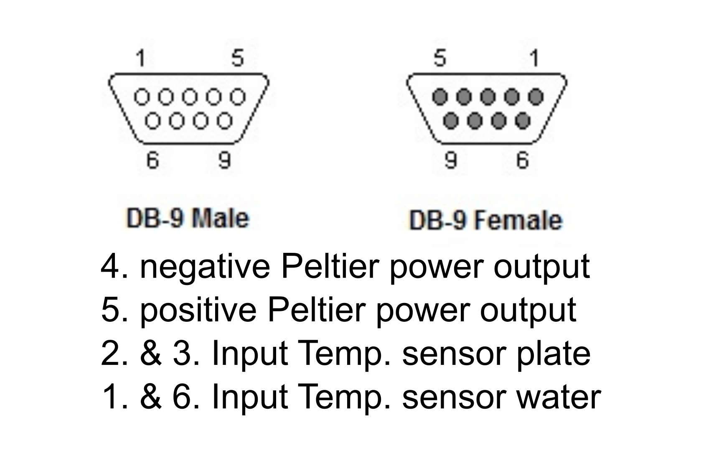

# Single Channel Temperature Controller

This repository contains the installer files for the software used to control a single channel temperature device.
The software is build upon Meerstetter `pyMeCom` library.
You can optionally configure the device using the software of the temperature controller manufacturer, which you can find and should download [here](https://www.meerstetter.ch/products/systems-software-accessories/software/tec-configuration-software?srsltid=AfmBOooxb5jjRMWZPumIRKpw8sMZ5eJLndWk0rA6gqxxQdCfwhyth1EP).
This should be done if you want to change the possible min and max temperature values or if you include a different sensor type. 

## How to get the software

In order to use the device and the software, you will need to download the newest installer file and follow the instructions.

## How to use the software

In order to use the software, follow these steps:

1. Install the software in a folder that is exectuable (this can be the standard 'Programs' folder but can differ depening on admin rights given by respective institutions).
2. Plug in the device to the front of the box (9-Pin connector, pin set up can be seen here), the USB into a free USB port on your PC and the power supply. 
	

	
	

   2.1 Check if there is any or sufficient water in the water cooling system. If not, it can be topped up by opening the small cap on the top of the box.
3. Turn on the device using the switch at the back - this will automatically launch the water cooling.
4. Launch the application on your device.
5. Then follow the steps as descibed on the window from top to bottom:
	1. Select a port to which the device is connected (usually starting with COM and a number, depends on your machine). If the selection is done right, you will be notified on the top and on the bottom, where the temperatures are displayed two number should appear on in red (plate temperature) and one in blue (medium temperature).
	2. Choose to define a temperature profile that you want to use:
		- you can adjust the time window for your experiment by changing the amount of minutes and the pressing 'Adjust time window'
		- you can adjust the temperature range of your experiement by changing the numbers and pressing 'Adjust T range'
		- you can create temperature profiles by left clicking on the figure to the right; each click generates a measurement point
		- each point can be adjusted by dragging it with the mouse coursor, or deleted by right clicking
		- if you are satisfied with the individual temperatures, then you can draw a curve by clicking 'Draw curve'
		- you also have the option to create oscillating profiles either in the form of a sinus or a square signal; select which type you would like to have, add the required parameters and then click 'Draw curve' to see the results
		- you can always reset all created curves by clickin 'delete'
		- in any case, if you are finished with setting your temperature profile, just click on 'Save temperature profile' which will close the additional window and transfer your wished profile back to the main application
		- notice that setting the temperature only influences the temperature measured on the heating/cooling plate and not the medium; calibration has to be done manually
		- if you wish to change it you can always click on 'Create profile' and create a new profile; if you wish to retrieve the create temperature profiles just go to the application folder where you will find a 'Temperature\_profiles' folder containing all created profiles

	3. After defining a profile, you can start an experiment by clicking 'Start experiment'; the experiment will run until the end of the selected time window and the automatically stop the device. If you wish to stop before then click on 'Stop TEC' to reset the experiment.
	4. If the experiment has finished you can leave the program by clicking 'Exit'

6. After finishing, please turn of the device by flipping the switch at the back of the controller box. Next time you can start experiments directly from point 2.1.

## How to get help

If there are any issues with the controller, the device or the software please reach out.
You can do that by either creating an issue in the Issue section of this repository under https://github.com/Gelens-Lab/temperature_controller/issues which can also be reached by clicking the question mark button in the top left corner of the application.
Please provide then your log file, which you can find in the temporary data folder under `C:\Users\<user name>\AppData\Local\Temp\Temperature_GUI.log`.

Or contact us directly:

**Bartosz Prokop**, (bartosz.prokop@kuleuven.be) for questions regarding hardware and software

**Lendert Gelens**, (lendert.gelens@kuleuven.be) for questions regarding experimental setups

